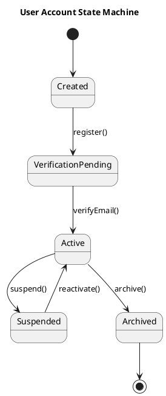

# TechmoEDU Smart Learning Platform

# PlantUML Directory

**Module**

State Machine Diagram Module

**Directory**

diagrams/plantuml/

**Document Type**

Enterprise PlantUML Modeling Standard

**Version**

1.0

---

# Purpose

The **plantuml/** directory contains the source code for all UML State Machine Diagrams created using PlantUML.

Unlike image files, PlantUML diagrams are text-based, version-controlled, and automatically renderable. They serve as the canonical textual representation of UML State Machine Diagrams and support collaborative development, automated documentation generation, and continuous integration workflows.

Every State Machine Diagram shall have an equivalent PlantUML source file.

---

# Objectives

The objectives of this directory are to:

- Maintain text-based UML diagram sources.
- Support Git-based version control.
- Enable automated diagram generation.
- Ensure synchronization with Draw.io diagrams.
- Improve maintainability.
- Simplify future modifications.
- Support enterprise software engineering practices.

---

# Scope

This directory stores only **.puml** source files.

Generated PNG images, Draw.io files, PDFs, screenshots, and implementation source code shall not be stored here.

---

# Directory Structure

```
plantuml/

├── README.md

├── 01-User-Account-State-Machine.puml

├── 02-Student-Registration-State-Machine.puml

├── 03-Course-State-Machine.puml

├── 04-Course-Enrollment-State-Machine.puml

├── 05-Attendance-Session-State-Machine.puml

├── 06-Examination-State-Machine.puml

├── 07-Marks-Results-State-Machine.puml

├── 08-Fee-Payment-State-Machine.puml

├── 09-Learning-Resource-State-Machine.puml

├── 10-Announcement-State-Machine.puml

├── 11-Parent-Student-Link-State-Machine.puml

└── 12-Teacher-Assignment-State-Machine.puml
```

---

# File Naming Convention

Each file shall follow the standard naming convention.

Format

```
<Sequence Number>-<Business Entity>-State-Machine.puml
```

Examples

```
01-User-Account-State-Machine.puml

05-Attendance-Session-State-Machine.puml

12-Teacher-Assignment-State-Machine.puml
```

---

# PlantUML Standards

Every source file shall:

- Start with `@startuml`
- End with `@enduml`
- Include a descriptive title
- Follow UML 2.5.x notation
- Use meaningful state names
- Include transition events
- Include guard conditions
- Include entry, exit, and do activities where applicable

---

# Standard Template



---

# State Naming Rules

State names shall:

- Use PascalCase
- Represent business conditions
- Be meaningful
- Avoid abbreviations

Correct examples

```
VerificationPending

PaymentProcessing

AttendanceLocked

ResultsPublished

TeacherAssigned
```

Avoid

```
State1

Running

Temp

Process

Unknown
```

---

# Transition Rules

Every transition shall use UML syntax.

```
event [guard condition] / action
```

Examples

```
submitRegistration
[documentsValid]
/
createStudent()
```

```
approveEnrollment
[paymentCompleted]
/
activateEnrollment()
```

---

# Initial and Final States

Every State Machine Diagram shall include:

- Exactly one Initial State
- At least one Final State

Example

```
[*] --> Draft

Draft --> Active

Active --> Archived

Archived --> [*]
```

---

# Composite States

Composite States should be used for complex workflows.

Example

```
state PaymentProcessing {

Pending

Authorized

Completed

}
```

Composite States should remain cohesive and readable.

---

# Choice Nodes

Choice Nodes shall model conditional branching.

Example

```
Draft --> Approved : approve()

Draft --> Rejected : reject()
```

Where appropriate, guard conditions should accompany the transitions.

---

# Entry, Exit and Do Activities

States may define lifecycle actions.

Example

```
state Active {

entry / recordLogin()

do / monitorSession()

exit / saveHistory()

}
```

---

# Notes

PlantUML notes should explain:

- Business Rules
- Constraints
- Exceptions
- Validation Requirements

Example

```
note right of Active

Only verified users
may enter this state.

end note
```

---

# Layout Guidelines

Diagrams should:

- Flow top-to-bottom or left-to-right.
- Minimize crossing transitions.
- Group related states.
- Maintain readability.
- Avoid excessive nesting.

---

# Styling Standards

Recommended styling:

```
skinparam shadowing false

skinparam dpi 300

skinparam state {

BackgroundColor White

BorderColor Black

ArrowColor Black

FontName Arial

FontSize 12

}
```

---

# Rendering Standards

Generated diagrams shall:

- Render without syntax errors.
- Produce high-resolution output.
- Match the Draw.io version.
- Maintain consistent visual appearance.

---

# Synchronization Policy

Whenever a Draw.io diagram changes:

1. Update the PlantUML source.
2. Validate syntax.
3. Generate a new PNG.
4. Review documentation.
5. Commit all related files together.

All diagram formats shall remain synchronized.

---

# Validation Checklist

Before committing:

- @startuml present
- @enduml present
- Title defined
- Initial State exists
- Final State exists
- State names meaningful
- Events correctly labeled
- Guards documented
- Actions documented
- No syntax errors
- Diagram renders successfully
- Diagram matches Draw.io version

---

# Repository Workflow

```
Business Requirement

↓

State Machine Design

↓

Draw.io Diagram

↓

PlantUML Source

↓

Syntax Validation

↓

PNG Generation

↓

Documentation Update

↓

Git Commit

↓

Release
```

---

# Best Practices

- One diagram per file.
- Keep source code readable.
- Use comments where appropriate.
- Keep transitions concise.
- Avoid duplicated states.
- Use consistent naming.
- Follow UML 2.5.x standards.
- Keep PlantUML synchronized with Draw.io.

---

# Related Directories

```
diagrams/

drawio/

png/

archive/
```

---

# Related Documents

- README.md
- 01-State-Machine-List.md
- 02-State-Machine-Descriptions.md
- 03-State-Transition-Rules.md
- 04-State-Machine-Standards.md
- diagrams/README.md
- drawio/README.md
- archive/README.md

---

# Version History

| Version | Date | Description |
|----------|------|-------------|
| 1.0 | Initial Release | Enterprise PlantUML Modeling Standard |

---

# Approval

Prepared For

**TechmoEDU Smart Learning Platform**

Software Design Documentation

Enterprise PlantUML Modeling Standard

Approved by

Software Architecture Team

---
